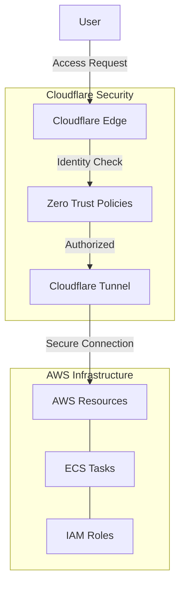

# Cloudflare Modules

This directory contains reusable Terraform modules for Cloudflare integrations in AllCare's infrastructure. These modules establish and configure secure connections between AWS resources and Cloudflare services.

## Available Modules

### Cloudflared (`cloudflared/`)

Module that configures the Cloudflare Tunnel client (cloudflared) infrastructure for establishing secure connections to Cloudflare's edge network.

**Key features:**
* Cloudflared container task definition
* Secrets management for tunnel credentials
* CloudWatch logging configuration
* IAM permissions and policies

### Zero Trust (`zero-trust/`)

Module for configuring Cloudflare Zero Trust access policies and application configurations.

**Key features:**
* Access application definitions
* Policy configuration for identity-based access
* Service authentication
* Network and device posture controls

## Architecture



## Module Usage

### Cloudflared Module

```hcl
module "cloudflared" {
  source = "../modules/cloudflare/cloudflared"
  
  container_image   = "cloudflare/cloudflared:latest"
  cpu               = 256
  memory            = 512
  
  tunnel_name       = "prod-tunnel"
  tunnel_secret_arn = "arn:aws:secretsmanager:us-west-2:123456789012:secret:tunnel-token"
  
  vpc_id            = module.vpc.vpc_id
  subnet_ids        = module.vpc.private_subnets
  
  log_retention     = 30
}
```

### Zero Trust Module

```hcl
module "zero_trust" {
  source = "../modules/cloudflare/zero-trust"
  
  applications = [
    {
      name           = "internal-dashboard"
      domain         = "dashboard.internal.example.com"
      session_duration = "24h"
    }
  ]
  
  policies = [
    {
      name       = "allow-employees"
      precedence = 1
      decision   = "allow"
      include    = ["email_domains:example.com"]
    }
  ]
}
```

## Security Considerations

### Authentication & Authorization

* **Token-based Authentication**: Secure tunnel tokens managed through AWS Secrets Manager
* **Zero Trust Access**: All access is verified through identity and context
* **Session Management**: Configurable session durations and refresh requirements

### Network Security

* **Outbound-Only Connections**: No inbound connectivity requirements
* **End-to-End Encryption**: All traffic is encrypted between client and Cloudflare edge
* **Private Networking**: Resources remain in private subnets

### Compliance

* **Audit Logging**: Comprehensive logging of access events
* **Service Authentication**: Service-to-service authentication options
* **Device Posture**: Optional device security requirements

## Best Practices

1. **Token Management**
   * Store tunnel tokens in AWS Secrets Manager
   * Rotate tokens according to security policy
   * Use least-privilege IAM policies for token access

2. **Access Policies**
   * Define policies based on identity, not network location
   * Implement multi-factor authentication where appropriate
   * Use specific, granular policies rather than broad rules

3. **High Availability**
   * Deploy multiple tunnel instances across AZs
   * Use Fargate Spot for cost optimization but ensure sufficient capacity
   * Monitor tunnel health and implement alerts

## Related Resources

* [Cloudflare Integration Directory](../../cloudflare/)
* [Docker Cloudflared Container](../../docker/cloudflared/)
* [ECS Cloudflared Module](../../modules/ecs/cloudflared/)
* [IAM Tunnel Role](../../modules/iam/cf-tunnel-role/)

## License

Copyright (c) Adaptive Technology  
SPDX-License-Identifier: Apache-2.0
