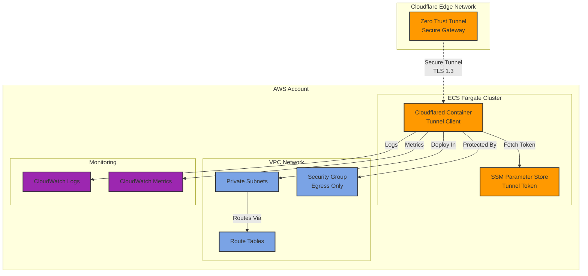

# Cloudflare Zero Trust Deployment Module

This module creates a complete Cloudflare Zero Trust deployment with AWS ECS integration.

## Features

- Creates and configures a Cloudflare Zero Trust tunnel
- Deploys ECS Fargate cluster running cloudflared
- Manages tunnel token securely in AWS SSM Parameter Store
- Configures IAM roles with least-privilege access
- Sets up CloudWatch logging with configurable retention
- Supports auto-scaling based on CPU/Memory utilization
- Integrates with existing VPCs via private subnets

## Architecture



## Usage

```hcl
module "cloudflare_zt" {
  source = "git::https://github.com/AdaptiveWorX/iac-modules.git//modules/cloudflare/zero-trust-deployment?ref=v1.0.0"

  prefix      = "dev-aws"
  environment = "dev"
  aws_region  = "us-east-1"

  # Cloudflare configuration
  cloudflare_account_id = var.cloudflare_account_id
  cloudflare_api_token  = var.cloudflare_api_token
  tunnel_name          = "dev-aws-tunnel"
  
  tunnel_routes = [
    {
      network = "10.192.0.0/10"
      comment = "DEV VPC access"
    }
  ]

  # VPC configuration
  vpc_id          = module.vpc.vpc_id
  vpc_cidr        = module.vpc.vpc_cidr_block
  private_subnets = module.vpc.private_subnet_ids

  # ECS configuration
  cpu           = "256"
  memory        = "512"
  desired_count = 2
  fargate_type  = "FARGATE_SPOT"

  # Auto-scaling
  enable_auto_scaling = true
  min_count          = 1
  max_count          = 4

  tags = {
    Environment = "dev"
    ManagedBy   = "terraform"
  }
}
```

## Requirements

| Name | Version |
|------|---------|
| terraform | >= 1.0 |
| aws | >= 5.0 |
| cloudflare | >= 4.0 |
| random | >= 3.0 |

## Providers

| Name | Version |
|------|---------|
| aws | >= 5.0 |
| cloudflare | >= 4.0 |
| random | >= 3.0 |

## Inputs

| Name | Description | Type | Default | Required |
|------|-------------|------|---------|:--------:|
| prefix | Prefix for resource names | `string` | n/a | yes |
| environment | Environment name (dev, staging, prod) | `string` | n/a | yes |
| aws_region | AWS region | `string` | n/a | yes |
| cloudflare_account_id | Cloudflare account ID | `string` | n/a | yes |
| cloudflare_api_token | Cloudflare API token | `string` | n/a | yes |
| cloudflare_version | Version of cloudflared image | `string` | `"2024.1.0"` | no |
| tunnel_name | Name for the Cloudflare tunnel | `string` | n/a | yes |
| tunnel_routes | List of routes for the tunnel | `list(object)` | n/a | yes |
| vpc_id | VPC ID where resources will be created | `string` | n/a | yes |
| vpc_cidr | VPC CIDR block | `string` | n/a | yes |
| private_subnets | List of private subnet IDs | `list(string)` | n/a | yes |
| cpu | CPU units for ECS task | `string` | `"256"` | no |
| memory | Memory (MB) for ECS task | `string` | `"512"` | no |
| desired_count | Desired number of ECS tasks | `number` | `2` | no |
| min_count | Minimum tasks for auto-scaling | `number` | `1` | no |
| max_count | Maximum tasks for auto-scaling | `number` | `4` | no |
| fargate_type | Fargate type (FARGATE or FARGATE_SPOT) | `string` | `"FARGATE_SPOT"` | no |
| log_retention_days | CloudWatch log retention | `number` | `30` | no |
| enable_auto_scaling | Enable auto-scaling | `bool` | `false` | no |
| tags | Tags to apply to resources | `map(string)` | `{}` | no |

## Outputs

| Name | Description |
|------|-------------|
| tunnel_id | ID of the created Cloudflare tunnel |
| tunnel_name | Name of the created Cloudflare tunnel |
| tunnel_cname | CNAME value for the tunnel |
| ecs_cluster_name | Name of the ECS cluster |
| ecs_cluster_arn | ARN of the ECS cluster |
| ecs_service_name | Name of the ECS service |
| security_group_id | ID of the security group |
| log_group_name | Name of CloudWatch log group |
| execution_role_arn | ARN of ECS execution role |
| ssm_parameter_name | Name of SSM parameter |

## Security Considerations

1. **API Token Security**: The Cloudflare API token is marked as sensitive and should be provided via environment variables or secure secret management
2. **Tunnel Token**: Stored encrypted in AWS SSM Parameter Store
3. **Network Isolation**: ECS tasks run in private subnets with no inbound rules
4. **IAM Roles**: Least-privilege access with only required permissions
5. **Logging**: All container logs are sent to CloudWatch for audit trails

## Cost Optimization

- Use `FARGATE_SPOT` for non-production environments (up to 70% savings)
- Configure appropriate CPU/Memory based on actual usage
- Set reasonable log retention periods
- Enable auto-scaling to handle variable loads efficiently

## Monitoring

The module creates CloudWatch dashboards and alarms for:
- ECS task health
- CPU/Memory utilization
- Tunnel connection status
- Error rates in logs

## Troubleshooting

### Common Issues

1. **Tunnel not connecting**
   - Check ECS task logs in CloudWatch
   - Verify Cloudflare API token permissions
   - Ensure outbound internet access from private subnets

2. **High CPU/Memory usage**
   - Review auto-scaling policies
   - Check for unusual traffic patterns
   - Consider increasing task resources

3. **Connection timeouts**
   - Verify security group rules
   - Check VPC route tables
   - Ensure NAT gateway/instance is functioning

### Debug Commands

```bash
# Check ECS service status
aws ecs describe-services \
  --cluster dev-aws-us-east-1-cf-tunnel-cluster \
  --services dev-aws-us-east-1-cf-tunnel

# View recent logs
aws logs tail /ecs/dev-aws-us-east-1-cf-tunnel --follow

# Get tunnel status
cloudflared tunnel info <tunnel-id>
```

## License

Apache-2.0
